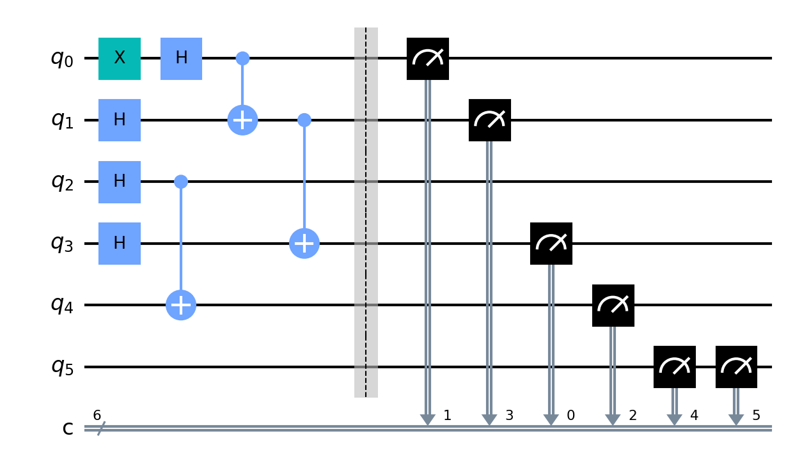
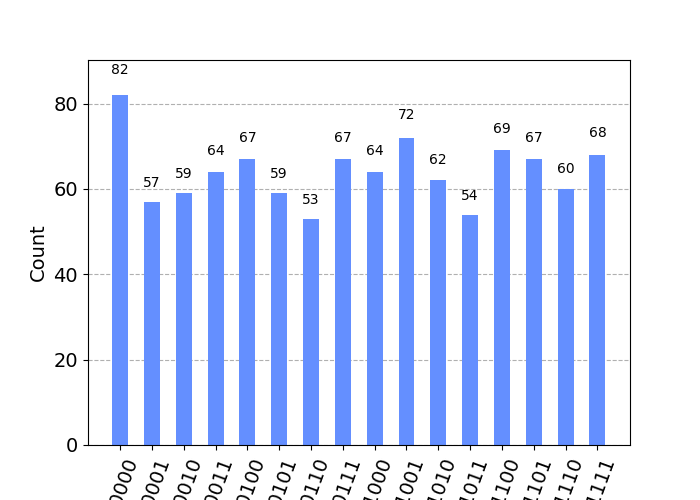

# ZA25 Quantum Communication Simulation

This repository is a fork of [https://github.com/CETQAP/ZA25-Protocol/tree/main](https://github.com/CETQAP/ZA25-Protocol/tree/main).

This repository contains the implementation of a quantum communication simulation inspired by the ZA25 protocol, developed by the Centre of Excellence for Technology Quantum and AI (CETQAC). The project achieves a 100 km repeater-enhanced simulation with a fidelity of 0.9950, real-time 10-bit transmission of the message "10" with a fidelity of 0.946, and 100% shot accuracy. Built using Qiskit to demonstrate advancements in Quantum Secure Direct Communication (QSDC).

## Prerequisites

* Python 3.8 or higher
* Qiskit 0.44 or later (`pip install qiskit`)
* NumPy and Matplotlib for data analysis and visualization
* Git for version control

## Sample Results

### Circuit Diagram

### Qiskit Circuit

### Measurement Histogram

### Hardware Results

### Measurement Results Table

| measurement | counts |
| ----------- | ------ |
| 000010      | 59     |
| 001001      | 72     |
| 000101      | 59     |
| 001010      | 62     |
| 001111      | 68     |
| 001101      | 67     |
| 000000      | 82     |
| 000111      | 67     |
| 000001      | 57     |
| 000011      | 64     |
| 000110      | 53     |
| 001000      | 64     |
| 001110      | 60     |
| 000100      | 67     |
| 001100      | 69     |
| 001011      | 54     |
